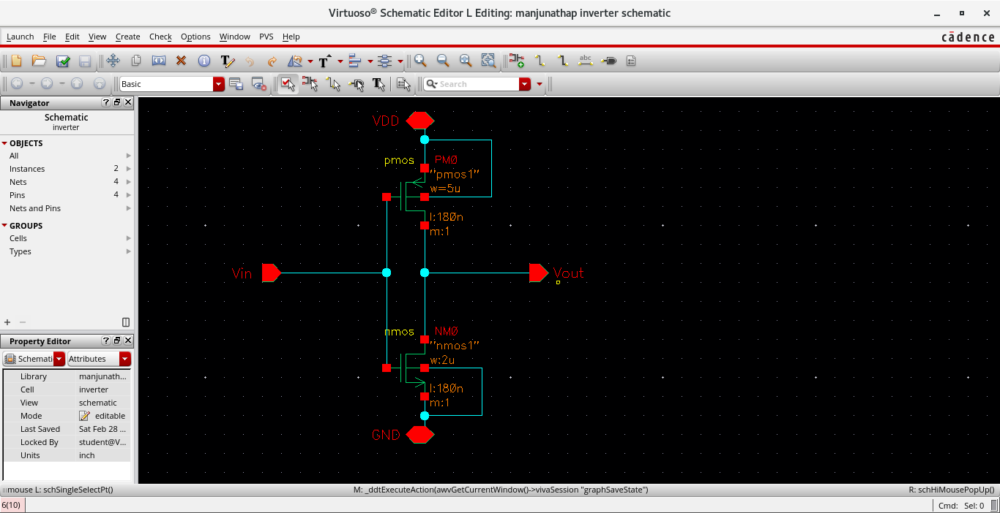
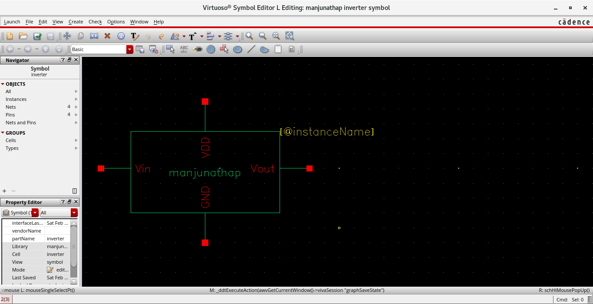
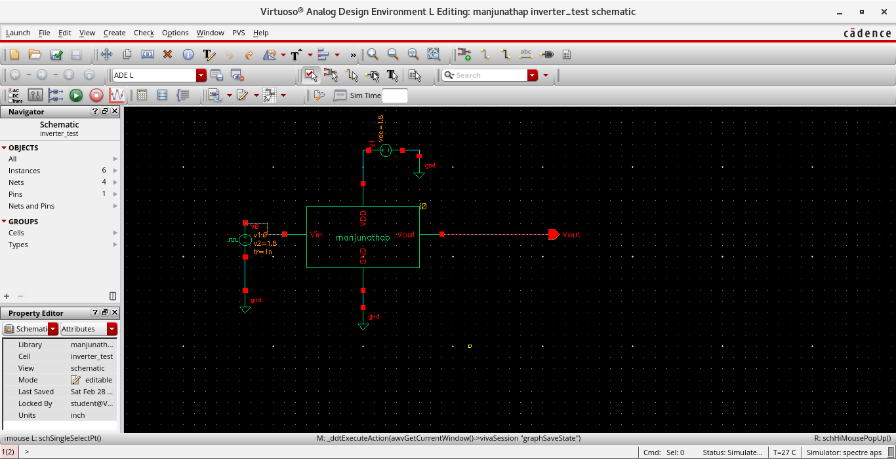

# Inverter – Cadence Lab Experiment

## Objective
To design and simulate an inverter using Cadence Virtuoso.

## Technology
180nm  
VDD = 1.8V  

## Design Parameters
PMOS: W = 5µm, L = 180nm  
NMOS: W = 2µm, L = 180nm  

---

## 1. Schematic

---

## 2. Symbol

---

## 3. Test circuit

---

## 4. Simulation Results

### DC Analysis
- Inverter VTC observed.
- Switching threshold ≈ 0.9V.

### Transient Analysis
- Output inverted relative to input.
- Rise and fall transitions visible.

---

## Learning Outcome

- Understood inverter operation.
- Learned symbol creation and testbench setup.
- Observed DC and transient characteristics.
